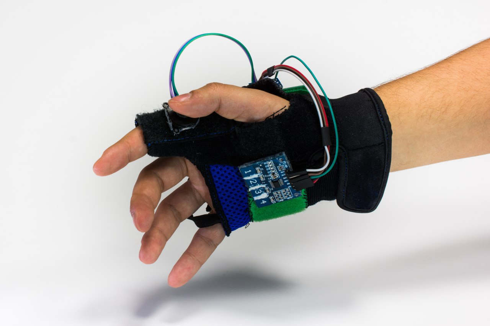
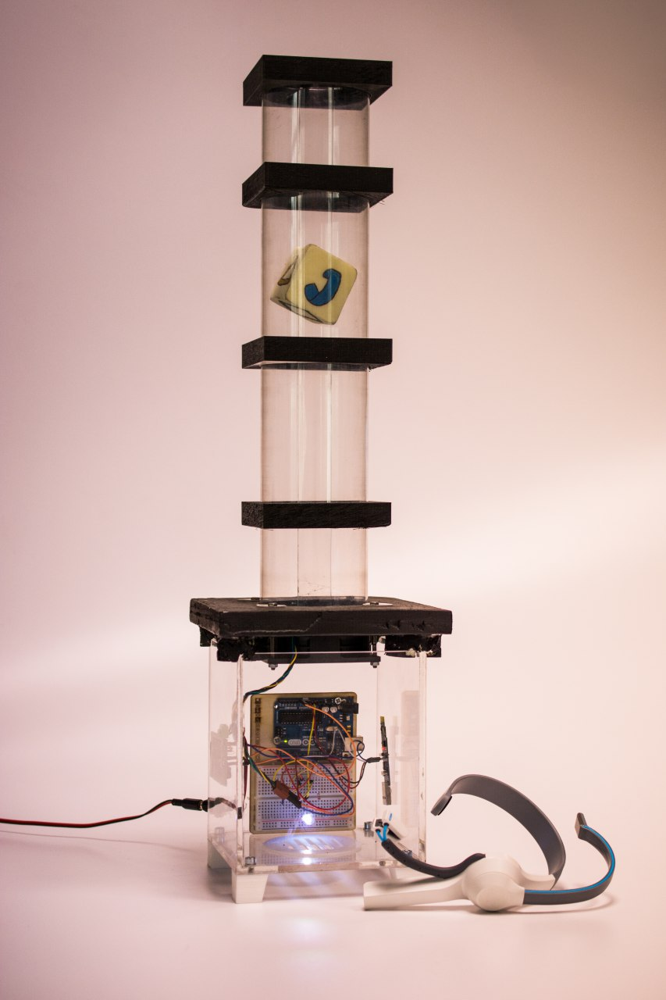

# IT-Content-DEV

 

## Power Glove & Use the Force

During my period at JEToP I developed within a team two prototypes:

- A glove able to control a video game through the motion of the hand; 

- A sensor able to understand when the individual was focused measuring his brainwaves. 
The result of this process was a rise of a cube obtained through the use of a fan which rotates faster as long as the user is more concentrated.

 

We presented those products in different occasions: 

- at the [Wearable Tech Torino (WTT)](https://www.wearabletechtorino.com/it/) , the first event about wearable technologies in Italy organised by JEToP. 

- at [TedX Torino](http://www.tedxtorino.com/) , one of the TED-like events supported by TED.
